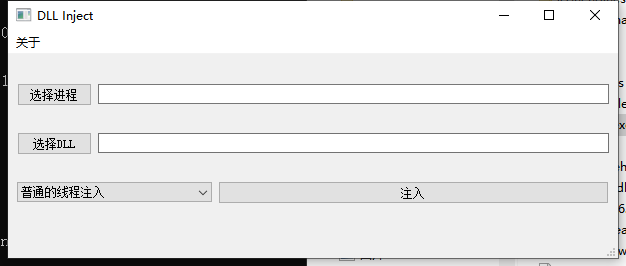

## 手动映射注入DLL

## 项目打包
1. 先构建MinGw32-bit和MinGw64-bit两个版本
2. 手动创建release/x64和release/x86文件夹
3. 将构建的32位release/DLLInject.exe拷贝到release/x86下
4. 将构建的64位release/DLLInject.exe拷贝到release/x64下
5. 打开MinGW 32-bit控制台，进入目录 `cd /d <你的目录>\release\x86`，执行命令`windeployqt DLLInject.exe`
6. 打开MinGW 64-bit控制台，进入目录 `cd /d <你的目录>\release\x64`，执行命令`windeployqt DLLInject.exe`

## 注:
- 如果你要注入的程序是x86那么就用 x86/DLLInject.exe
- 如果你要注入的程序是x64那么就用 x64/DLLInject.exe
- 可能会注入失败

